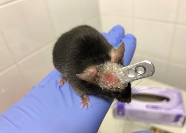
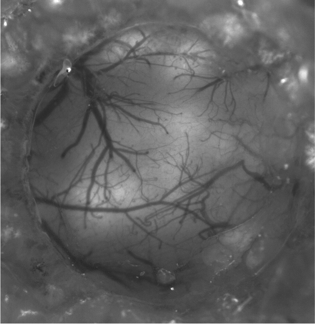
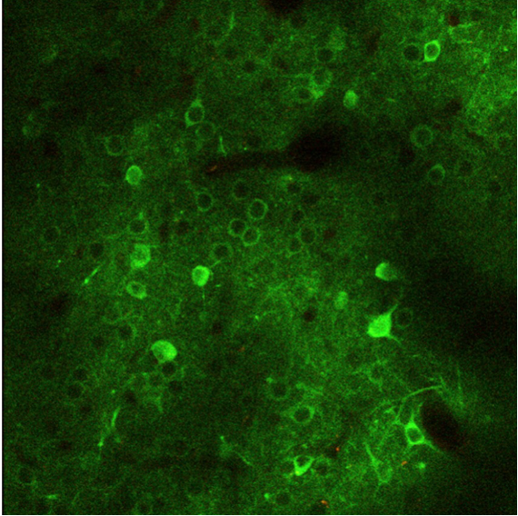

# Abstract

The deciphering of the neural code is one of the last grand mysteries of physiology. Using methods such as calcium imaging or electrophysiology to record activity of genetically defined neurons, researchers around the globe hope to gain critical insight into how information is coded and processed by the nervous system.

The aim of this project is to apply techniques of statistical machine learning to real-world neuronal activity data and help describe how sensory stimuli are represented in the murine auditory cortex.

This project is a part of the PSTAT 231 course (instructed by dr. Katie Coburn [@d]). Since the overall objective of this project is to learn how to use the tools we were presented during class, we will try to fit as many models we covered during class as possible.

# Introduction

## Theoretical background

Brain tissue is organized into functionally and anatomically distinct regions. These specialized areas often perform very specific tasks such as handling of sensory information, calculate appropriate motor commands and many others. However, traditionally, the only detectable output other than the behavioral or physiological change itself is the variation in electrical properties of single neurons residing at the given site. The link between neuronal activity and its global effect is still very poorly understood. Since it is key to the understanding of how the information is coded and processed, it is subject to intense research. 

The classical approach towards studying brain areas handling sensory information is based on observing responses of single neurons to various changing parameters [@theunissen2014] . The collected data is subsequently translatable into neuron-specific receptive fields (RFs), study of which has revealed tonal organization of neurons both in the lower parts of the auditory pathway (mouse dorsal inferior colliculus [@barnstedt2015] and in the auditory cortex [@issa2014]. The available data might suggest that the processing of the auditory input is dependent on single neurons encoding the perception of the input component that provokes them to maximal activity[@frégnac2015]. Furthermore, this hypothesis is in accord with the "neuronal doctrine" [@barlow1972], which suggests such coding in other parts of the brain as well.

Although such linear coding of single input components is supported by data from lower levels of the auditory pathway \[@andoni2007\], neurons from higher levels express significant non-linearity in their response patterns \[@bathellier2012; @nelken2004; @deneux2016\] (. For example, certain neurons specifically respond to unique physical attributes of natural sounds rather than being strictly frequency-tuned [@theunissen2014]. These non-linear responses are context-dependent [@kato2015], thus oppose the classic, exclusively feed-forward model and require the inclusion of input from local neuronal populations. 

In the light of growing evidence, it became apparent that the application of the classical receptive field concept in the auditory cortex should be revisited and possible alternatives need to be investigated. Another important factor was the appearance of novel techniques capable of recording large genetically defined neural populations,which has enabled in vivo testing of alternative models (namely two-photon imaging of genetically encoded calcium indicators [@lütcke2011; @chen2013]. Unlike the classical electrophysiological approach, these are not limited to recordings of a small number of neurons, a limitation having strongly shaped the direction of scientific effort in the past.

The search for an alternative brought attention to a model already proposed for the hippocampal navigational apparatus. Here, specialized cell-types such as head direction cells or place cells encode spatial navigation and their activity is hypothesized to be organized following an attractor network model [@zhang1996; @redish1999]. The attractor network model suggests that a specifically stimulated neuron excites cells of similar tuning (highly interconnected) while the lack activation results in the inhibition of cells responsive to different values of the given variable (due to a global inhibition net) [@redish1999].

\
The activity of local cortical networks (of span \~200 µm) was discovered to be limited to very few reciprocally competitive response modes (mostly 1-3), while the shift between them is abrupt [@bathellier2012b], thus expressing attractor-like dynamics. Such discrete shifting between few possible modes suggests, that the attractor-like dynamics could form a base for the encoding of perceptual categories (Wang 2008). Moreover, the role of the auditory cortex has recently been hypothesized to lie within a more complex processing of the auditory input than previously thought, namely representing sounds as auditory objects [@russ2007]. Since the sensory categorization offers a balanced coding strategy between detail acquisition and generalization across experiences [@seger2010], it reasonably fits within the current context of the auditory cortex.

In summary, the investigation of discrete network dynamics and categorization in the mouse auditory cortex by [@bathellier2012] ( has produced a significant amount of useful information. Among these is evidence supporting the idea that it is not single neurons but hundreds of cells, which form a functional unit in the neocortex ([@averbeck2006] Moreover, it was shown that single subnetworks are comprised of a redundant number of cells and are non-discretely divided, possibly to counter the high overall noise. However, most importantly, it was shown that different response modes (of a local neuronal network) recorded by calcium imaging reflect the categorization of sounds observed also behaviorally, thus suggesting that the attractor final states may be directly representing the perceptual category.

In their experiments, Bathellier et al. have used a small organic dye, Oregon Green BAPTA-1 (OGB-1), which was the state-of-the-art calcium indicator at the time. Unfortunately, the use of OGB-1 is restricted to acute experiments only.

In this study, our aim was to reproduce the experiments performed by Bathellier et al. using a genetically encoded calcium indicator GCaMP7f [@dana2019], one of the first protein-based sensors matching the performance of OGB-1, and take advantage of the possibility to generate chronic preparations. Using this protocol, we set out to describe the temporal stability of cortical dynamics, namely that of cortical representations of complex auditory stimuli.

Note:

An important feature of neuronal activity in primary sensory cortices including the auditory cortex is that it is that is sparse and exhibits very high trial-to-trial variability [@hromádka2008]

## Materials and Methods

Mice were implanted with chronic cranial windows over their right auditory cortex (fig.1). Expression of a genetically encoded calcium indicator GCaMP7f (Addgene catalog number: 104488-AAV9) in the underlying tissue was achieved using microinjection (Nanoject iii, Drummond inc.).



After three weeks of recovery, mice were checked for expression (fig.2) and entered the imaging protocol.



During the first day of imaging (day 0), multiple fields of view (FOV) (fig.3) were subjected to 10 repeats of a 39-stimulus battery of auditory stimuli (awake imaging). These include pure tones, complex sounds and natural stimuli mimicking what could be a physiologically relevant auditory percept. The stimulation battery was kindly provided by dr. Bathellier.



During stimulation, changes in fluorescence of the calcium indicator were recorded using a Two-photon microscope (Ultima iv, Prarie view) running the ScanImage (Vidrio technologies).

Time bins of 250ms after the presentation of the stimulus (39 randomized stimuli in 1 trial, 1s interstimulus intervals, 10 trials per session) were analyzed using the in-house developed TwoPhotonProcessor software \[@tomek2013a\]. Spike probabilities were extracted from changes in fluorescence cause by action potential evoked calcium transients using the foopsi algorithm and compiled in MATLAB into matrix form (fig.4).


We have revisited the same FOV one day after the first session and subsequently every five days until day+30. The same battery of stimuli was presented to the same neurons under matching conditions. Fig.5 provides an example of how the activity pattern elicited by a single sound (sound6) changes bewteen sessions (titles above columns (yyyymmdd))

The resulting dataset it comprised of 15 FOVs from 11 animals and as such is imported into R.


## Experimental aim

The aim of this project is to analyze the above described data using methods of statistical machine learning.

Our goal is to answer the following questions:

1.  Can we detect a consistently stable representation of a sensory stimulus in the inherently noisy and variable calcium imaging data using unsupervised learning?

2.  Is it possible to train a machine learning model to classify whether a specific trial was or was not elicited by a sound represented in the recorded neuronal population.

3.  Which model performs the best?

## Library loading

First, we load all of the required libraries

```{r library loading, error=F, message=FALSE, warning=FALSE, echo=T}
library(R.matlab)
library(readr)
library(tidyverse)
library(data.table)
library(cluster)
library(dendextend)
library(factoextra)
library(ROCR)
library(boot)
library(caret)
library(glmnet) 
library(tree) 
library(maptree) 
library(randomForest) 
library(gbm) 
library(e1071)
```

# Pre-processing

## Data loading

Some of the functional analysis had to be performed in MATLAB since the Two Photon Processor [@tomek2013] , the framework used for raw fluorescence trace analysis, does not exist outside MATLAB. Consequently, data in the form of a MATLAB structured list is imported and transformed into a tibble dataframe

```{r data import, error=F, warning=FALSE, echo=T, cache=TRUE}

dataMat <- R.matlab::readMat("sortAudFile.mat",fixNames=T, ) 
f19<-dataMat$sortAudFile[1]
f33<-dataMat$sortAudFile[2]
f34a<-dataMat$sortAudFile[3]
f34b <-dataMat$sortAudFile[4]
f34c <-dataMat$sortAudFile[5]
f35  <-dataMat$sortAudFile[6]
f37  <-dataMat$sortAudFile[7]
f38 <-dataMat$sortAudFile[8]
f40 <-dataMat$sortAudFile[9]
f41a <-dataMat$sortAudFile[10]
f41b <-dataMat$sortAudFile[11]
f42  <-dataMat$sortAudFile[12]
f43a <-dataMat$sortAudFile[13]
f43b <-dataMat$sortAudFile[14]
f44  <-dataMat$sortAudFile[15]

df<-as_tibble(f34c[[1]][[1]][[1]])

df = df %>% add_column(sound = 1)
df = df %>% add_column(day = 0)

tempF = f34c[[1]]

for (j in c(1:8)){
  for (i in c(1:39)) {
   df = df %>% add_row(tibble(as_tibble(tempF[i][[1]][[j]]),sound = i,day = j-1))
  }
  }
  
df$sound = factor(df$sound)
df$day = factor(df$day)
df.Day <-  df%>% filter(df$day==0)
df.neurons <-  df.Day%>% select(V1:V34)
```

# EDA

To be supplied by Katti

```{r eval=FALSE, warning=FALSE, include=FALSE}

sumVect <- c(1:39)
  
for (i in c(1:39)) {
  df.sound = NULL
  df.sound <-  df%>% filter(df$sound==i)
  
  temp.df<- as.matrix(df.sound%>%select(V1:V34))

  sumVect[i] = sum(colSums(temp.df))
 
  sortSum = sort(sumVect, decreasing = TRUE)
  
  which(sumVect==(head(sortSum)[1]))
   
}
```

# Feature extraction

## Hierarchical clustering

The hypothesis proposed by the work inspiring these experiments postulates that local neuronal populations represent sensory precepts by categorizing them into a small number of perceptual categories [@bathellier2012] Since our aim was to reproduce these results using tools enabling long-term imaging, we first try to identify sounds producing a recognizable activity pattern.

In order to do this, we employ an unsupervised learning method, **hierarchical clustering**.

We perform this on a data subset from the first day of recordings, since that is when fields of view were selected for long term studies by performing clustering online during imaging.

### Search for the sound of interest

First, we will loop through all of the days performing hierarchical clustering on the dataset. The reason why we chose this approach is the following:

-   Each day, the neuronal population had to be revisited and relabeled, which may introduce added variability and be regarded as different conditions.

-   Previously published work only tested stability within one imaging session so that is what we expect to see.

Based on previously published work, we expect to see a large general cluster containing most of the sounds that consistently fail to elicit a response. We are interested in the second, much smaller cluster consisting of a very small number of sounds (1-3) that do elicit a consistent response.

#### Data reloading

Repeated data reloading as a precautionary step in case some prior manipulation was introduced and not corrected.

```{r, error=F, warning=FALSE, echo=T, cache=TRUE}

#reloading data again for proper clustering

f34c = NULL
df = NULL
dataMat = NULL

dataMat <- R.matlab::readMat("sortAudFile.mat",fixNames=T, ) 
f34c <-dataMat$sortAudFile[5]

df<-as_tibble(f34c[[1]][[1]][[1]])

df = df %>% add_column(sound = 1)
df = df %>% add_column(day = 0)

tempF = f34c[[1]]

for (j in c(1:8)){
  for (i in c(1:39)) {
   df = df %>% add_row(tibble(as_tibble(tempF[i][[1]][[j]]),sound = i,day = j-1))
  }
  }
  
df$sound = factor(df$sound)
df$day = factor(df$day)
df.Day <-  df%>% filter(df$day==0)
df.neurons <-  df.Day%>% select(V1:V34)

```

#### Hierarchical clustering of activity patterns in response to a battery of 39 sounds

We loop through all of the imaging sessions (day 0, +1, +5, +10, +15, +20, +25 and +30) and perform hierarchical clustering of response patterns within each day. Finally, we look at which sound was clustered into the second cluster the most.

We limit the number of clusters to 2 as we do not expect to see more than 2 modes of response. One being no response, the other being an activity pattern elicited by one or a small number of stimuli.

```{r hclust,echo=T}


table.accum <- matrix(, nrow=2,ncol=8)
maxSecond <- matrix(, ncol=8)

for (k in c(0:7)){
  
  df.Day <-  df%>% filter(df$day==k)


df.neurons <-  df.Day%>% select(V1:V34)
dist_mat <- dist(df.neurons,method = "euclidian")


hclust_avg <- hclust(dist_mat, method = "average")
cut_avg <- cutree(hclust_avg, k = 2)


table.accum[,k+1] = table(cut_avg, df.Day$sound)[,33]
maxSecond[k+1] = as.numeric(which.max(table(cut_avg, df.Day$sound)[2,]))

}
```

**Below are the IDs of the stimuli that were most abundantly clustered into the second mode within each of the 8 sessions**

```{r max second, echo=T}
#Display the counts of 
maxSecond
```

#### An example dendrogram produced by hierarchical clustering during Day Zero

```{r dendrogram,echo=T}

df.Day <-  df%>% filter(df$day==0)
df.neurons <-  df.Day%>% select(V1:V34)
dist_mat <- dist(df.neurons,method = "euclidian")
hclust_avg <- hclust(dist_mat, method = "average")

## dendrogram: branches colored by 2 groups
dend1 = as.dendrogram(hclust_avg)
# color branches and labels by 2 clusters 
dend1 = color_branches(dend1, k=2)
dend1 = color_labels(dend1, k=2)
# change label size
dend1 = set(dend1, "labels_cex", 0.3)


plot(dend1,horiz=T, main = "Dendrogram colored by two clusters")

```

#### Result:

Sound number **33** is the most abundant sound eliciting a response pattern falling into cluster 2.

### Randomized sampling

In order to assess the relevance of hierarchical clustering performed on our data, we next try to analyze a randomized dataset.

Finding clusters of similar activity patterns within a **randomized** (random sampling of sounds with replacement)dataset, might indicate that any clusters we observe in the actual data might be, in fact, an artifact arising from the nature of the data.

#### Scrambling sound identities with replacement

```{r hclust randomized, echo=T, warning=FALSE}

#reloading data

f34c = NULL
df = NULL
dataMat = NULL

dataMat <- R.matlab::readMat("sortAudFile.mat",fixNames=T, ) 
f34c <-dataMat$sortAudFile[5]
df<-as_tibble(f34c[[1]][[1]][[1]])

df = df %>% add_column(sound = 1)
df = df %>% add_column(day = 0)
tempF = f34c[[1]]

#random sampling, scrambling sound identity, with replacement

set.seed(132)

for (j in c(1:8)){
  for (i in c(2:39)) {
    sound.random = sample(c(1:39),1)
   df = df %>% add_row(tibble(as_tibble(tempF[i][[1]][[j]]), sound = sound.random, day = j-1))
  }
  }
  
df$sound = factor(df$sound)
df$day = factor(df$day)
df.Day <-  df%>% filter(df$day==0)
df.neurons <-  df.Day%>% select(V1:V34)

#clustering
dist_mat <- dist(df.neurons,method = "euclidian")
hclust_avg <- hclust(dist_mat, method = "complete")
cut_avg <- cutree(hclust_avg, k = 2)
#table(cut_avg, df.Day$sound)

```

```{r,echo=T}


table.accum <- matrix(, nrow=2,ncol=8)
maxSecond <- matrix(, ncol=8)

for (k in c(0:7)){
  
  df.Day <-  df%>% filter(df$day==k)


df.neurons <-  df.Day%>% select(V1:V34)
dist_mat <- dist(df.neurons,method = "euclidian")


hclust_avg <- hclust(dist_mat, method = "average")
cut_avg <- cutree(hclust_avg, k = 2)


table.accum[,k+1] = table(cut_avg, df.Day$sound)[,33]
maxSecond[k+1] = as.numeric(which.max(table(cut_avg, df.Day$sound)[2,]))

}
```

**Below are the IDs of stimuli that were most abundantly clustered into the second mode within each of the 8 sessions while the sound identity was scrambled**

```{r resampled max second, echo=TRUE}
#Display the counts of 
#table.accum
maxSecond
```

#### Results

The identities of sounds and their distribution are different in a randomized sample, thus our recordings are likely not an artifact.

**Next we reload the non-randomized data for further analysis**

```{r data reload post random, echo=TRUE}

#reloading data again for further analysis

f34c = NULL
df = NULL
dataMat = NULL

dataMat <- R.matlab::readMat("sortAudFile.mat",fixNames=T, ) 
f34c <-dataMat$sortAudFile[5]

df<-as_tibble(f34c[[1]][[1]][[1]])

df = df %>% add_column(sound = 1)
df = df %>% add_column(day = 0)

tempF = f34c[[1]]

for (j in c(1:8)){
  for (i in c(1:39)) {
   df = df %>% add_row(tibble(as_tibble(tempF[i][[1]][[j]]),sound = i,day = j-1))
  }
  }
  
df$sound = factor(df$sound)
df$day = factor(df$day)
df.Day <-  df%>% filter(df$day==0)
df.neurons <-  df.Day%>% select(V1:V34)

```

### PCA analysis

In order to assess correlations between variables (neurons #1 to #38) we perform *principal component analysis*.

```{r pca, echo=T}

pca.neurons = prcomp(df.neurons, scale=TRUE, center = TRUE)

pr.var <- (pca.neurons$sdev)^2
pve=pr.var/sum(pr.var)
```

The graphical representation of the **proportion of variance explained by single principal components**

```{r pve plot}
plot(pve, xlab="Principal Component",
     ylab="Proportion of Variance Explained ", ylim=c(0,1),type='b')
```

The graphical representationof the ***cumulative*** **proportion of variance explained by single principal components**

```{r cumpve plot}
plot(cumsum(pve), xlab="Principal Component ",
     ylab=" Cumulative Proportion of Variance Explained ", ylim=c(0,1), type='b')

abline(v =min(which((cumsum(pve)>=0.9))))

```

#### Results

We observe that in order to explain 90% of total variation in the data, we need at least **27** principal components. The high number of components suggests we indeed do need all of our variables in order to capture the variance, thus we should use all of them in our future analysis

## Summary

Using methods of unsupervised learning, namely hierarchical clustering, we were able determine the presence of a consistently represented sound of interest in one of the FOVs.

The FOV in question is **f34c** while the sound selected based on the number of times it was clustered into the non-general cluster is **sound 33.**

Coming back to the first question of our experimental aim: *Can we detect a consistently stable representation of a sensory stimulus in the inherently noisy and variable calcium imaging data using unsupervised learning?*

The conclusion is that **yes**, we were able to detect a specific sound that did elicit a discernable population response detectable in multiple sessions. The consistency may seem low (see **4.1.1.2**), but as it is highest in between-session it was chosen as a valid canditate for further analysis.

The low consistency is likely caused by a combination of factors including:

-   high trial-to-trial variability of responses inherent to the neocortex

-   changing conditions of recording (changes in expression levels)

-   changes in the state of the animal (laboratory mouse strains are know to become deaf fairly quickly)

# Supervised learning

In this part, we aim to answer the second part of our experimental aims (questions 2 and 3):

In the following paragraphs, we will try to train, tune and evaluate multiple classes of models we covered during class.

## Data preparation

First, we need to create a factor variable defining whether the observation was obtained as a response to the examined sound. Based on the hierarchical clustering performed earlier, this stimulus number is sound **33**,

```{r, include=FALSE}

df = df %>%
  mutate(s33=as.factor(ifelse(sound == "33", "Yes","No")))

```

#### Split

Since only one sound is considered a positive case, our data contains a small fraction of positive cases for learning and training purposes (1/39). For that reason, it is important to perform stratified sampling, so that the limited number of positive labels is evenly split between training and testing data sets.

```{r splitting, echo=TRUE}

#stratified

set.seed(123)
df <- df %>% mutate(id = row_number())
#Check IDs
head(df$id)
train.index <- createDataPartition(df$s33, p = .7, list = FALSE)

train <- df[ train.index,]
test  <- df[-train.index,]
```

## Model fitting

The choice of model is determined by the data. Since the the task at hand is to train a model to **classify** whether a population response was or was not elicited by sound 33, we will start with *logistic regression*

### Logistic regression

The dataset needs to be further **formatted** in order to satisfy the input requirements by the *glm*() function. Whats is presented to the model is the activity of neurons (variables V1:V38) and a factor variable of levels Yes/No determining whether the observation was recorded in response to sound 33 or not.

```{r certain values, echo=T, message=FALSE, warning=FALSE}
#generate subdatasets of only activity data for learning purposes
excl<-c('sound','day','id')
train.cv <- train %>% select(., -excl)
test.cv <- test %>% select(., -excl)
```

**Model training**

```{r GLM fit, echo=T, message=FALSE, warning=FALSE}
model.glm = glm(formula = s33~., data=train.cv, family = binomial)
#summary(model.glm)

```

In order to calculate the error rate, we use the function we were given as a part of homework assignment

```{r error rate def, echo=TRUE, message=FALSE, warning=FALSE}
calc_error_rate <- function(predicted.value, true.value){
  return(mean(true.value!=predicted.value)) }
```

#### Training and Testing error rate for GLM

We proceed with fitting the data with our model. Minor formatting of the prediction output is needed to obtain a training and testing error

```{r glm errors, message=FALSE, warning=FALSE, echo=T}
prob.training.glm = NULL
prob.training.glm = as.factor(ifelse(predict(model.glm, type="response")>0.5,"Yes","No"))
```

Training error

```{r training error, echo=T}
trainError<- calc_error_rate(prob.training.glm,train$s33)
trainError
```

Test error

```{r test error, echo=T}
testError<- calc_error_rate(prob.training.glm,test$s33)
testError
```

**Conclusion:**

According to these rates, the model classifies a given observation in **\~3%** of the cases.

The *testing error* is slightly higher than the *training error,* which can be expected due to the fact that none of the data in the **test** split were available for training.

#### Plotting the ROC curve

Another useful method for assessing the performance of a classifier is the *Receiver Operating Characteristic* (ROC) curve plotting the **True positive rate** against the **False positive rate.**

```{r ROC glm, message=FALSE, warning=FALSE, echo=TRUE}
prob.training.glm = NULL
prob.training.glm =predict(model.glm)
pred.glm = prediction(prob.training.glm, train.cv$s33)
perf.glm = performance(pred.glm, measure="tpr", x.measure="fpr")

plot(perf.glm, col=2, lwd=3, main="ROC curve")
abline(0,1)

```

#### Computing AUC

*Area under curve* (AUC) is a useful metric describing the performance of the classifier based on the ROC curve. Ranging from 0 to 1, the resulting number is a good indicator of the % accuracy of model predictions.

```{r auc glm}

auc.glm = performance(pred.glm, "auc")@y.values
auc.glm

```

**Results:**

The performance of the model as assessed by the *Area under curve* **(AUC)** metric seems to be fairly good

However, since the positive label is so sparse in our data and most of the correctly predicted cases are the ***Not Sound 33***, we should investigate more options of performance evaluation.

#### Cross-validation using the whole dataset for a better estimate of the test error.

In order to solidify our results, it is useful to perform cross-validation, meaning we retrain our model on multiple randomly selected subsets of data. The aim of this approach is to mitigate the danger of skewed results caused by the nature of the data and provide a statistically relevant result.

```{r cv glm, echo=T, warning=F}

cost <- function(r, pi = 0) mean(abs(r-pi) > 0.5)

model.glm.cv<-cv.glm(test.cv,model.glm,cost,10)

```

The two values below describe:

-   The raw cross-validation estimate of prediction error.

```{r cv glm delta1, echo=TRUE}

model.glm.cv$delta[1]

```

-   The adjusted cross-validation estimate designed to compensate for the bias introduced by not using leave-one-out cross-validation.

```{r cv glm delta2, echo=TRUE}

model.glm.cv$delta[2]

```

10-fold cross validation has produced similar error rates to our previous estimates. However, this does not necessarily solve the problem of having too little positive cases (meaning cases when an observation belongs to sound 33). This metric might be still very heavily skewed by the fact that classifying a non-sound33 observation correctly also results in a true positive.

Thus, we need should investigate whether the accuracy of classification extends to all levels of the factor variable **s33**.

#### Confusion matrix

Constructing a confusion matrix should provide the most insight into how well the model can classify whether an observation was or was not elicited by sound 33.

```{r conf matrix glm,echo=T}

prob.training.glm = as.factor(ifelse(predict(model.glm, type="response")>0.5,"Yes","No"))
confusionMatrix(data = prob.training.glm, reference = train.cv$s33)


```

**Results**

Although the overall accuracy of the model is high, it is clear that it's accuracy in terms of correctly predicting the YES case in sound33 variable is fairly **poor**. Thus we should try and investigate options how to improve this performance

### **Regularization of logistic regression models**

Building on the logistic regression model, we can try and improve its performance by introducing penalties to different coefficients of the model. This can prevent overfitting and aid with classification performance.

### Ridge

The first regularization method we will try is the *ridge* regression. In this case, we perform *L2 regularization* meaning we impose a penalty equaling the **square** of the magnitude of coefficients. As such, no coefficients can reach zero.

We can aim to tune the "magnitude" of the penalty imposed by ridge regression by trying different values for the parameter of lambda.

**As λ increases, the flexibility of the ridge regression fit decreases, leading to decreased variance but increased bias.**

Thus, we will perform 10-fold cross-validation using different **λ** in order to find it's optimal value for minimal misclassification error.

The resulting value for **λ :**

```{r ridge train, echo=TRUE}
lambda.list.ridge = 1000 * exp(seq(0, log(1e-5), length = 100))

train.neurons <- train.cv %>% select(V1:V34)
train.labels <- as.factor(train.cv$s33)
test.neurons <- test.cv %>% select(V1:V34)
test.labels <- as.factor(test.cv$s33)


set.seed(1)
model.ridge.cv=cv.glmnet(as.matrix(train.neurons),train.labels, alpha = 0,nfolds = 10, lambda = lambda.list.ridge, family="binomial", type.measure ='class') 
lambdaSelect <- model.ridge.cv$lambda.min
lambdaSelect

```

The minimal misclassification error achieved by fine tuning the value of **λ**

```{r mse ridge}
model.ridge.cv$cvm[which (lambda.list.ridge==lambdaSelect)]
```

Plot showing how different values of **λ** reflect in the misclassification error

```{r mse ridge plot}
plot(model.ridge.cv)
abline(v = log(lambdaSelect))

```

Plot showing how different values of **λ** reflect in the adjustment of coefficients in the resulting model ( the vertical line represents the value of **λ** we selected)

```{r coefs ridge}

plot(model.ridge.cv$glmnet.fit, "lambda", label=FALSE)
abline(v = log(lambdaSelect))
```

As we demonstrated above, in our case the confusion matrix is the most useful way of assessing model performance

```{r ridge cmatrix, echo=TRUE}


pred.ridge=predict(model.ridge.cv,s=lambdaSelect, newx = as.matrix(test.neurons), type="response") 

pred.ridge = as.factor(ifelse(pred.ridge>0.5,"Yes","No")[,1])


confusionMatrix(data = pred.ridge, reference = test.labels) 
```

#### Results

The ridge model has **failed** to classify any of the positive cases as positive, thus it has not improved the result obtained by linear regression

### Lasso

The second regularization method we can use is LASSO (Least Absolute Shrinkage and Selection Operator).

Compared to Ridge, Lasso works with the *absolute value of magnitude* of coefficient in order to penalize coefficients. Consequently, when using lasso, we can eliminate some coefficients altogether, practically performing feature selection.

Here we also operate with a parameter **λ** that can be subject to tuning. Using 10-fold cross-validation we arrive at the following **λ** value:

```{r lasso train, echo=TRUE}
lambdaSelect = NULL

lambda.list.lasso = 1000 * exp(seq(0, log(1e-5), length = 100))

train.neurons <- train.cv %>% select(V1:V34)
train.labels <- train.cv$s33
test.neurons <- test.cv %>% select(V1:V34)
test.labels <- test.cv$s33

set.seed(1)
model.lasso.cv=cv.glmnet(as.matrix(train.neurons),train.labels, alpha = 1,nfolds = 10, lambda = lambda.list.lasso, family="binomial") 

lambdaSelect <- model.lasso.cv$lambda.min
lambdaSelect

```

The minimal misclassification error achieved by fine tuning the value of **λ**

```{r mse lasso}
model.lasso.cv$cvm[which (lambda.list.ridge==lambdaSelect)]

```

The number of coefficient that are not zero when using the above-selected value of **λ**

```{r nonzero lasso}
model.lasso.cv$nzero[which (lambda.list.ridge==lambdaSelect)]

```

Plot showing how different values of **λ** reflect in the adjustment of coefficients in the resulting model ( the vertical line represents the value of **λ** we selected)

```{r plot lasso}
plot(model.lasso.cv$glmnet.fit, "lambda", label=FALSE)
abline(v = log(lambdaSelect))
```

Again, we construct a confusion matrix in order to look at how the model performs

```{r validation lass, echo=TRUE}
pred.lasso=predict(model.lasso.cv,s=lambdaSelect, newx = as.matrix(test.neurons), type="response") 

pred.lasso = as.factor(ifelse(pred.lasso>0.5,"Yes","No")[,1])

confusionMatrix(data= pred.lasso, reference = as.factor(test.labels))

```

#### Results:

Although the Lasso model performed better than Ridge, it still does not reach the level of basic logistic regression.

### Summary:

Based on these results, imposing penalties on or reducing the number of features does not improve the overall performance of the model. Seemingly, all of the features are needed equally in order to represent the neuronal response we wish to categorize

## Tree models

The next class of models we wish to try are decision trees. Often compared to the "game of 20 questions", decision trees are highly successful in both regression and classification problems while providing an understandable, or even "palatable" graphical representation of the model. Tree models also perform well on larger datasets

However, there are several limitations that need to be considered. In our case that is mainly the danger of **overfitting** as trees can be very non-robust against changes in data. Our data is inherently variable from trial to trial, therefore could prove non-ideal for tree application.

### Regular

First, we train a regular decision tree model

```{r basic tree, message=FALSE, warning=FALSE, echo=T}

model.tree <- tree(s33 ~ ., data=train.cv)
summary(model.tree)

```

This model produces a low misclassification error rate. However, aware of the fact of how our data is structured we need to investigate further.

#### Pruning

We can try and use cross-validation in order to prune the tree off of branches

```{r crossval tree, echo=TRUE}
cv <- cv.tree(model.tree, K=10, FUN = prune.misclass)
best.cv = min(cv$size[cv$dev == min(cv$dev)])

best.cv

```

Unfortunately, the lowest misclassification error is achieved when there is only one branch, which, if pruned at the very bottom, *kills* the tree model as the main branch becomes the terminal leaf.

#### Validation

Inspired by our previous work, we now look at the confusion matrix of the original model

```{r tree validation,echo=T}
prob.training.tree=NULL

prob.training.tree = predict(model.tree, test.cv, type="class")


confusionMatrix(data = prob.training.tree, reference = test.cv$s33)
```

#### Results:

Unfortunately, the non-pruned tree model has not been able to classify positive cases of sound 33 better than any of the previously fitted models.

#### Boosted trees

Since we have shown that it is challenging for a single decision tree to perform at our classification task, we will next try to combine a large number of "weak-learner" trees into an aggregated model where each tree is weighted based on its misclassification error. This method is called boosting.

We train a boosted tree model using 10000 trees and evaluate its perfomance using a confusion matrix

```{r boosted trees, warning=FALSE,echo=TRUE}

set.seed(123)  # for reproducibility

model.gbm <- gbm(ifelse(s33=="Yes",1,0) ~ ., data = train.cv,  n.trees = 10000, shrinkage = 0.01)

prob.training.boost=NULL

prob.training.boost = as.factor(ifelse(predict(model.gbm, test.cv, type="response")>0.5,"Yes","No"))

confusionMatrix(data = prob.training.boost, reference = test.cv$s33)
```

#### Results

According to the number of correctly classified positive cases, boosted trees have produced results slightly better than every model except for logistic regression.

#### Random forest

The last class of decision tree-based models is random forest. This method, similarly to boosting, uses many individual decision trees. However in the case of a random "forest of trees", the segregating nodes defining branches are different since the single decision trees are trained on a random subsample from the dataset. This possibly mitigates the challenges posed to regular decision trees such as overfitting and non-robustness.

```{r rforest train, echo=T}

model.rfor = randomForest(x = train.neurons, y = train.labels, x.test= test.neurons, y.test=test.labels, ntree=10000, strata=s33, replace=TRUE, importance=T, mtry=30)


```

Since the randomForest() function can take in the test dataset, the model object contains a confusion matrix

```{r rfor confusion}
model.rfor$confusion

```

#### Results

Based on the confusion matrix the random forest method was unable to outperform the logistic regression.

#### Summary:

While very successful in many machine learning problems due to their ability to implement non-linear decision surfaces, the performance of decision trees was not superior to other models in our case.

This was possibly caused by the noise in our data and very large trial-to-trial variability. By trying to determine which variables and their combinations help best in the classification of the data, decision tree-based models might loose the more "holistic" view of the population activity, which may be required in order to robustly learn the ever-changing representation.

### Support-Vector Machines

The last model class we wish to try are support-vector machines (SVMs). This type of model uses support vectors determined by the training data in order to compute an optimal separating hyperplane. In addition, SVMs are capable of performing non-linear classification by transforming a low-dimensional input space into a higher dimension, which could in some cases help with separation (such as the two circular classes of data we saw in lecture).

In order to use the best model possible, we first tune the **budget** (cost) and **gamma** parameters.

We use the function tune() from the **e1071** library to do so, specifying the number of cross-validation folds and even enabling random sampling.

```{r svm tuning, cache=TRUE}
  obj <- tune(svm, s33~.,
                  data = train.cv,
                  ranges = list(gamma = 2^(-5:5), cost = 2^(1:8)),
                  tunecontrol = tune.control(cross = 5, nboot = 10,sampling = "boot")
             )
  
  summary.svm<-summary(obj)
  best.gamma.svm<-summary.svm$best.parameters[,1]
  best.cost.svm<-summary.svm$best.parameters[,2]
```

best **gamma** dget based on tuning

```{r}
best.gamma.svm
```

best **budget**(cost) dget based on tuning

```{r}
best.cost.svm
```

Now we can train the model

```{r svm training, message=FALSE, warning=FALSE}
model.svm = svm(formula = s33 ~ .,
                 data = train.cv,
                 type = 'C-classification',
                 kernel = 'polynomial',
                cost = best.cost.svm,
                gamma = best.gamma.svm
                )

```

#### Validation of SVM

As in all of the previous cases, we evaluate the performance of the model using a confusion matrix

```{r svm validation}
pred.svm = predict(model.svm, newdata = test.cv)

confusionMatrix(data = pred.svm, reference = test.cv$s33)
```

#### Results:

SVMs did not perform better than the previously applied models. A possible reason for this might be the relatively high sensitivity of SVMs to noise. Since our data is inherently noisy and sparse, single outliers may have a large influence on the computation of the optimal separating hyperplane even though the budget parameter is set to its optimal value.

# Discussion

We have analyzed a real-world calcium imaging dataset using methods of statistical machine learning, in order to demonstrate the existence of stable stimulus representation in neuronal activity.

After a significant amount of analysis performed within MATLAB (due to the limited availability of fluorescence processing tools in R), we were able to import and reformat a dataset representing recordings of neuronal activity of single cells within the murine auditory cortex.

Using unsupervised learning, we were able to select a candidate sound of interest (**sound 33**) in a specific mouse (**f34c**)by assessing its capacity to be clustered into a non-general mode of response of the population. As such we have succeeded in completing our first experimental aim.

Next, we tried fitting multiple model classes and strategies in order to train a classifier able to distinguish between the sound of interest and the rest of the stimuli.

We report that the **logistic regression** model displayed the best performance in terms of correctly classifying the positive case of population activity elicited by sound 33.

Although not an ideal classifier, given the nature of the data and its high trial-to-trial variability, this can be regarded as a positive result suggesting that the population response to a specific sound is something a machine learning model can be trained to recognize, thus adding relevance to the ideas presented in the theoretical introduction.

The reason for this result might be, hypothetically, that logistic regression has a tendency for **higher bias and lower variance**, which makes it less prone to overfitting and enables it to make stronger assumptions. Thus, it can possibly be able to take a more "holistic" approach without being overly dependent on the quality (in terms of noise for example or sparsness) of the training dataset.

On the other hand, decision trees and SVMs are more prone to be negatively influenced by noisy data as they rely on quality training sets. They are able to capture non-linearity within the data, but this advantage is perhaps rendered obsolete by the lower quality of the training data.

# References
